**The Dual Masters Problem**  
Why Institutions Inevitably Betray Their Stated Purpose

**Version** 1.0  
**Author**: Maldfrey  
**Release Date**: May 2026 

**Repository**: [https://github.com/maldfrey/whitepapers](https://github.com/maldfrey/whitepapers) 

**License**: Creative Commons Attribution 4.0 International (CC BY 4.0)

---

**Executive Summary**

Every institution begins with a noble stated purpose. Yet the moment it exists as a living organization, it immediately acquires a second master: its own survival, growth, status, and the comfort of its insiders.

This is the **Dual Masters Problem**. Purpose 1 is the original mission. Purpose 2 is self-perpetuation. At scale, Purpose 2 almost always wins.

Leaders must pay a hidden **Leadership Mobilization Cost** — a constant mix of patronage (favors, protection, status) and coercion (shame, rules, career threats) — simply to unlock real discretionary effort from large numbers of people. Formal rules and incentives alone are rarely enough.

Over time, institutions optimize for **acceptability** (what internal coalitions will tolerate) over **suitability** (what actually solves the problem). Through survivorship bias, those who rise are often those most skilled at navigating acceptability, frequently believing the two are the same.

The larger and more complex the organization becomes, the sharper the trade-off: it must either accept significantly lower efficiency or accept significantly higher systemic risk. Centralized systems — especially planned economies and massive bureaucracies — suffer this in its most virulent form because they lack external market discipline. Failure does not punish them; it justifies more resources and more authority.

Mode B dominance makes the decay particularly durable by providing perfect moral camouflage: self-interest is reframed as compassion, expansion as progress, and institutional self-preservation as “protecting the vulnerable.”

The result is organizations that become anti-fragile for insiders and fragile for everyone else, steadily consuming the competence, shared reality, and long-term stewardship required for civilizational health.

This paper examines how the Dual Masters Problem operates, why it is so difficult to reverse, and what realistic restoration requires.

---

**Problem Statement**

If one steps back from the noise of public life, it is impossible not to admire the sheer elegance with which our major institutions manage their exit from the hazard of objective results. It is handled with complete bureaucratic grace. It is also a bit of a muddle.

Every enterprise begins with an explicit, high-status prospectus carved into its foundation stone.

* A school is chartered to prepare children for the friction of reality.

* A regulator is retained to protect the public commons.

* A health service is funded to heal the sick.

* A government is paid to maintain order and defend the realm.

It is a charming arrangement. It ensures the morning commute feels like a pilgrimage rather than a shakedown.

Yet, over any meaningful horizon, these structures invariably default on their primary notes. They undergo a profound thermodynamic drift away from their stated utility. The apparatus grows larger, more expensive, and entirely inward-facing. Real output steadily contracts, while internal rituals, compliance frameworks, and self-justifying budgets aggressively expand.

This civilizational leakage is rarely the work of cartoon villains or grand conspiracies. Such explanations are the comfort of simple minds who require a visible face to hate. In reality, the decay is entirely mechanical. It is the predictable outcome that activates the precise moment an organization becomes a living entity with an independent survival instinct.

The human agents within these systems—frequently decent, industrious, and perfectly unexceptional—are merely reacting rationally to localized incentives. Meeting a harsh, empirical external standard is an exhausting, low-yield business. It is infinitely more agreeable to optimize for variables that guarantee institutional stability and a serene career path.

Naturally, they prioritize what their immediate colleagues will accept without a fuss. One must keep the peace in the staff room, after all.

```mermaid
graph TD
    %% Base Styling
    classDef primary fill:#f9f9f9,stroke:#333,stroke-width:2px,color:#111;
    classDef master1 fill:#e6f3ff,stroke:#0066cc,stroke-width:2px,color:#003366;
    classDef master2 fill:#fff0f0,stroke:#cc0000,stroke-width:2px,color:#660000;
    classDef outcome fill:#fff,stroke:#555,stroke-dasharray: 5 5,color:#333;

    INST["THE INSTITUTION<br>(Real-World Entity)"]
    class INST primary;

    M1["MASTER 1: STATED<br>External Mission<br>(Educate / Heal / Defend)"]
    class M1 master1;
    
    M2["MASTER 2: HIDDEN<br>Internal Solvency<br>(Tenure / Budgets / Status)"]
    class M2 master2;

    O1["High Public Utility"]
    class O1 outcome;
    
    O2["High Private Comfort"]
    class O2 outcome;

    INST --> M1
    INST --> M2
    M1 --> O1
    M2 --> O2

    %% Visual Linkage
    M1 -.->|Subordinated At Scale| M2
  ```

Consequently, they elevate internal harmony and a highly curated moral self-image far above harsh external results. Through an act of convenient psychological arbitrage, they treat the sheer survival and expansion of the organization as entirely synonymous with the original mission.

If a few cohorts emerge from school unable to read, or if the hospital queues lengthen as the budgets balloon, the administrator views it as a very small price to pay for a quiet life. God forbid anyone make a scene before bank holiday.

The final yield of this process is a quiet but absolute betrayal. Institutions engineered to perform a distinct external function gracefully reorganize around serving their own internal balance sheets first. They become brilliantly anti-fragile for the insiders who draw status from them, and catastrophically fragile for the broader populace forced to underwrite the default.

This is the **Dual Masters Problem**.

The remainder of this ledger will examine how this marvelous trap works, why its software is completely immune to traditional political pushback, and what the ultimate bill of lading looks like before the whole house of cards hits the wall of reality-enforced scarcity.

Do pull up a chair. There should be just enough time to finish our tea before the roof completely falls in.

---

**Section 1: The Core Dynamic** 

If one wishes to understand the inner life of the administrative state, one must first grasp that every living institution is a bigamist. It answers, by its very nature, to two entirely distinct masters.

Purpose 1 is the noble declaration etched into the founding charter or displayed on the highly polished plaque in the foyer. It is the explicit reason the organization was granted permission to draw breath and taxes: to educate children, protect the public, heal the sick, or defend the realm. It is a lovely, comforting narrative, rather like the myth that the local vicar actually enjoys the village fete.

Purpose 2, however, is never written down. It would look dreadfully untidy on the letterhead. Instead, it emerges organically the moment the institution materializes as a real-world entity with payrolls, budgets, careers, and internal politics. Purpose 2 is remarkably simple: survive, grow, insulate the insiders, expand the empire, and maintain the comfort and status of those who staff it.

```mermaid
graph LR
    %% Style Definitions
    classDef scale fill:#f5f5f5,stroke:#666,stroke-width:1px,color:#333;
    classDef dominant fill:#e1f5fe,stroke:#0288d1,stroke-width:2px,color:#01579b;
    classDef winner fill:#ffebee,stroke:#c62828,stroke-width:2px,font-weight:bold,color:#b71c1c;
    classDef muted fill:#fff,stroke:#bbb,stroke-dasharray: 3 3,color:#999;

    subgraph SMALL ["SMALL SCALE (Direct Accountability)"]
        S_M1["Purpose 1: Mission"]
        S_M2["Purpose 2: Survival"]
        S_M2 -->|Kept on Short Leash| S_M1
    end

    subgraph LARGE ["LARGE SCALE (Administrative Monopolies)"]
        L_M1["Purpose 1: Mission"]
        L_M2["Purpose 2: Survival"]
        L_M1 -->|Subordinated & Consumed| L_M2
    end

    %% Apply Section Styling
    class SMALL,LARGE scale;

    %% Apply Node Styling
    class S_M1 dominant;
    class S_M2 muted;
    class L_M1 muted;
    class L_M2 winner;

    %% Connect the Subgraphs
    SMALL ---> LARGE
```

At a modest scale, under the whip of a strong leader and pinned down by direct accountability, Purpose 1 can usually keep its seat at the head of the table. But at civilizational scale, within the vast, carpeted corridors of our great public monopolies, Purpose 2 almost always wins by default.

This victory is rarely the result of cartoon malice. It is merely the predictable output of information asymmetry and coordination failure. A senior administrator, tucked away in an office with a rather nice view of the park, cannot possibly see or compel the discretionary effort of thousands of subordinates. Formal rules are simply too blunt an instrument. To extract even a baseline level of initiative and alignment, leadership must quietly pay a hidden levy: the **Leadership Mobilization Cost**.

This internal tax is settled in two rather expensive currencies:

* **Patronage:** The distribution of promotions, expanded budgets, protection from consequences, and the polite tolerance of professional slack.

* **Coercion:** The application of shame, social pressure, career freeze-outs, and mandatory administrative retraining.

Neither currency comes cheap. Patronage structuralizes mediocrity and bloats the balance sheet, while coercion efficiently liquidates morale and kills off any spontaneous innovation. Most mature systems run an exceptionally expensive, highly unstable cocktail of both. It makes the tea in the canteen taste quite bitter, to be frank.

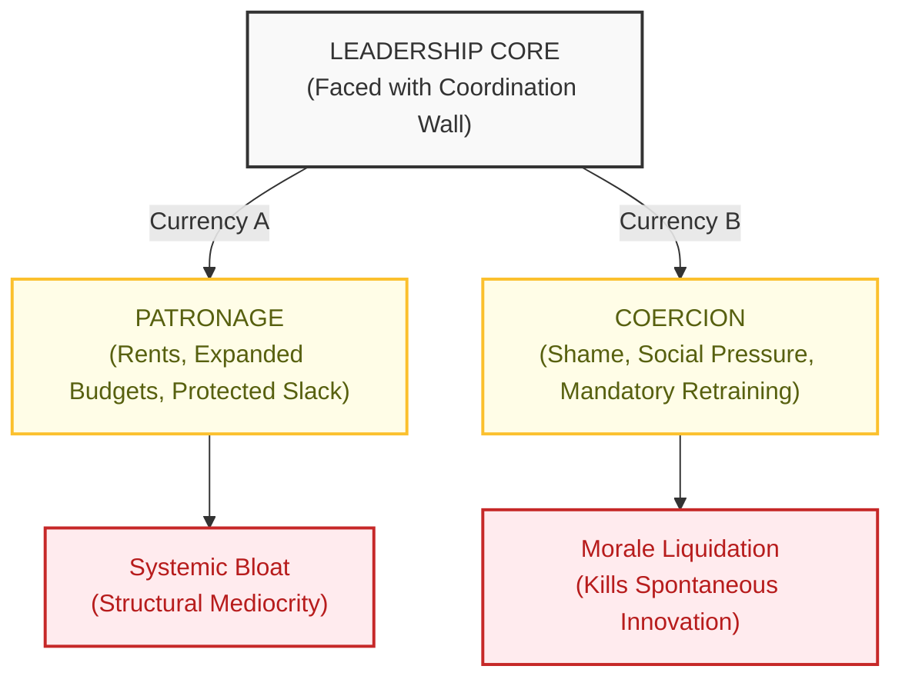

The primary mechanism by which Purpose 2 achieves total dominance is the quiet, elegant substitution of **acceptability** for **suitability**. Over time, the apparatus learns to optimize exclusively for what its internal coalitions will tolerate without throwing a tantrum, rather than what external reality actually demands.

Through a flawless process of survivorship bias, the individuals who glide effortlessly up the greasy pole are rarely those who solve external problems. They are the virtuosos of internal acceptability—the pleasant sorts who never rock the boat or spoil a meeting. In time, many of them come to sincerely believe that the acceptable choice *is* the suitable one. They confuse a quiet staff room with a successful campaign.

Purpose 2 never announces its arrival with a trumpet flourish. It simply becomes the default firmware of the system. The original mission is never formally discarded; it is merely subordinated, layer by layer, until the institution exists primarily to sustain the comfortable equilibrium of its own staff.

The entire process is beautifully mechanical. It requires no clandestine plots or grand conspiracies. It requires only standard human beings operating inside large, complex structures where the external feedback is weak and the tea is always warm.

---

**Section 2: Why Acceptability Defeats Suitability**

One of the most reliably depressing patterns in the life of any large human organization is the quiet, systematic elevation of **acceptability** over **suitability**. It is the sort of phenomenon that only becomes glaringly obvious in hindsight, usually during a post-mortem conducted by a parliamentary committee over a plate of curls of cold butter and stale rolls.

When a major institutional failure is finally laid out on the slab, observers are invariably left asking how a team of highly compensated, self-congratulating experts could have chosen so catastrophically poorly. The archives usually reveal that the committee did not choose the path that would solve the problem. They chose the path that made the meeting end on time without anyone losing their temper.

To understand this capitulation, we must separate the two terms with a clinical scalpel:

* **Suitability** is the option best aligned with external reality. It is the cold, frequently unpalatable choice most likely to actually resolve the crisis given the empirical constraints, harsh trade-offs, and long-term consequences.

* **Acceptability** is the option the group finds easiest to agree upon in the drawing-room. It is comfortable, entirely familiar, and beautifully aligned with the ego protection of the dominant internal coalition. It ensures that no powerful member of the hierarchy is made to feel incompetent, sidelined, or intellectually exposed.

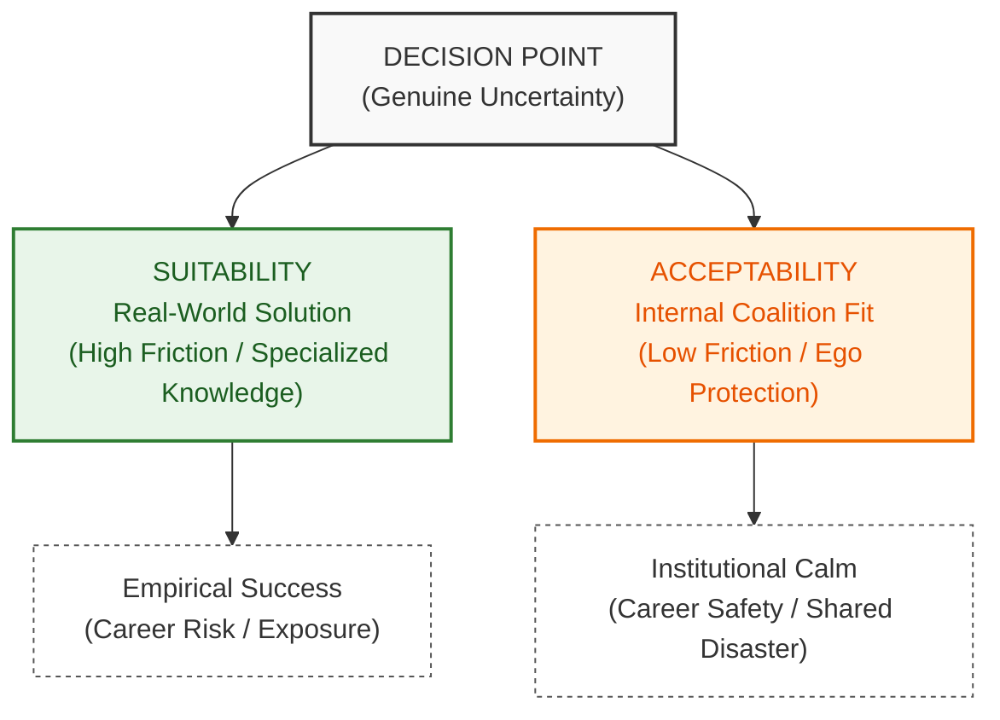

Because external reality is plagued by genuine uncertainty, the suitable choice is rarely self-evident. It often requires a high degree of technical specialized knowledge that the entire group does not share, or an uncomfortable reliance on data that makes the senior members feel slightly out of their depth.

The acceptable choice, by contrast, feels wonderfully safe to those holding administrative levers. It minimizes immediate friction with the colleagues who matter. It protects the internal power geometry. If it fails down the line, it fails collectively—and there is immense career security in a shared disaster.

To observe this dynamic in miniature, one need only look at a standard group project tasked with assisting a local business. A solitary member, perhaps possessing an unfortunate excess of ambition, proposes a sophisticated, experience-based floor layout grounded in rigorous marketing principles. It is a solution designed to guide distinct customer types toward the products they actually require.

The remainder of the committee, unfamiliar with the framework and unwilling to cede intellectual control to a single peer, rejects it out of hand. They prefer a solution where each person can do their own isolated, perfectly mediocre piece in their own corner. The group selects a bland compromise over a high-quality solution.

It is acceptability defeating suitability in a cleanroom environment.

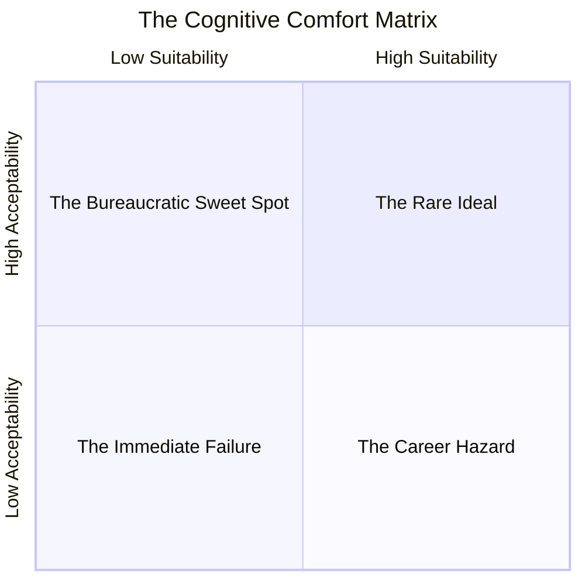

When scaled up to the tier of permanent administrative monopolies, this pattern hardens into concrete. Through a constant process of survivorship bias, the individuals who scale the greasy pole of the hierarchy are those who have spent decades refining their ability to manufacture acceptable outcomes.

In time, they do not merely choose acceptability because it is safe; they come to sincerely believe that the acceptable choice *is* the suitable one. They mistake the absence of an internal row for the presence of an external victory.

This is the silent advancement of Purpose 2\. It requires no malice, no backroom plots, and no cartoon villainy. It requires only standard human incentives operating under conditions of uncertainty, and the perfectly natural desire to ensure that one's colleagues remain agreeable through the end of the financial year.

---

**Section 3: How Scale Makes It Worse** 

The Dual Masters Problem is rarely fatal in a small, nimble enterprise. A competent founder or a tight-knit team can generally keep Purpose 2 on a remarkably short leash. They achieve this through direct oversight, a shared culture, and the deeply unfashionable practice of personal accountability. If the local blacksmith stops shoeing horses to spend his afternoons composing bad poetry, the community notices immediately. The feedback is instant, localized, and impossible to ignore.

But as organizations expand in size and structural complexity, the problem compounds geometrically. It is a transition that converts a manageable friction into a permanent, tax-funded dependency.

At scale, leadership confronts an insurmountable coordination wall. A director-general, safely ensconced behind double-glazed glass in Whitehall, cannot directly monitor or compel the discretionary effort of thousands of subordinates scattered across the provinces. Formal rules and performance metrics prove entirely too blunt for the task.

Mandating rigid quotas or key performance indicators (KPIs) invariably fails to capture the full range of useful human output. It efficiently eliminates the eccentric individuals who contribute in subtle but valuable ways, while encouraging the more cunning actors to rest on their laurels the precise moment they hit their targets.

As the metrics fail, employees learn to optimize exclusively for what is measured rather than what actually matters. This strengthens Purpose 2’s grip on the firmware. To unlock any real effort beyond bare-minimum compliance, leadership must quietly pay that hidden levy we noted earlier: the **Leadership Mobilization Cost**.

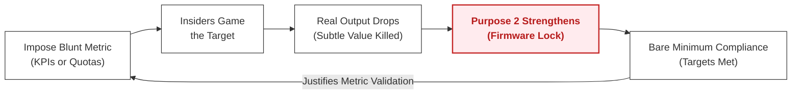

As we established, this tax is settled in two rather unappealing currencies: **Patronage** (the carrot of promotions, expanded budgets, and protected slack) and **Coercion** (the stick of social pressure, career freeze-outs, and mandatory administrative retraining).

To see this machine operating at maximum efficiency, one need only look at a charming historical allegory: **The Festival of the Stag**.

### **The Allegory of the Festival of the Stag**

Imagine a once-great rural estate that annually hosts a grand celebration involving feasting, music, games, and the temporary hiring of hundreds of villagers. Originally, the festival had an explicit, outward-facing utility: it honored the stag—the vital game animal that had sustained the local population through harsh winters—and strengthened transactional ties with the surrounding country.

Over generations, however, the festival’s purpose quietly shifted. It became the primary mechanism by which each successive lord demonstrated his generosity and secured his social status among his peers. The event grew predictably elaborate. More locals were placed on the payroll. More absurd traditions were invented. The cost swelled until it consumed a non-trivial portion of the estate’s annual revenue. It was a marvelous time for everyone involved, paid for entirely by the estate's capital reserves.

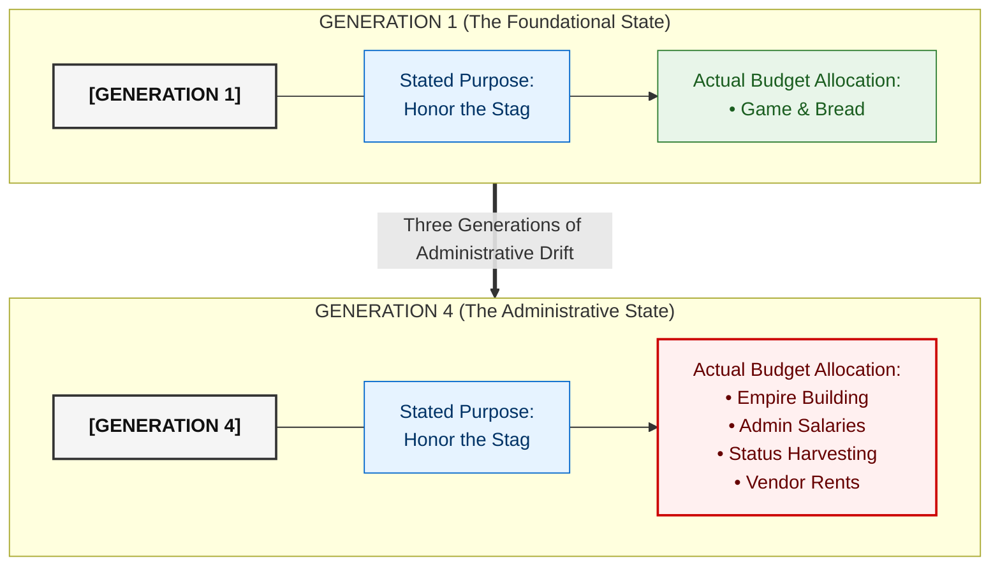

When a new, somewhat spreadsheet-minded lord reviews the accounts and correctly concludes that the festival must be drastically scaled back, he faces a difficult choice.

If he simply executes the cuts on line one without preparation, the systemic backlash is immediate and severe. Production in unrelated timber yards mysteriously declines. Key carriage suppliers suddenly encounter "unforeseen logistical difficulties" with deliveries. Long-standing allies cancel their weekend shooting engagements. Influential figures begin to look past him at public gatherings.

Resistance appears not as an open rebellion, but as a thousand tiny, bureaucratic frictions, all pointing in the exact same direction. It is a very polite, very effective siege.

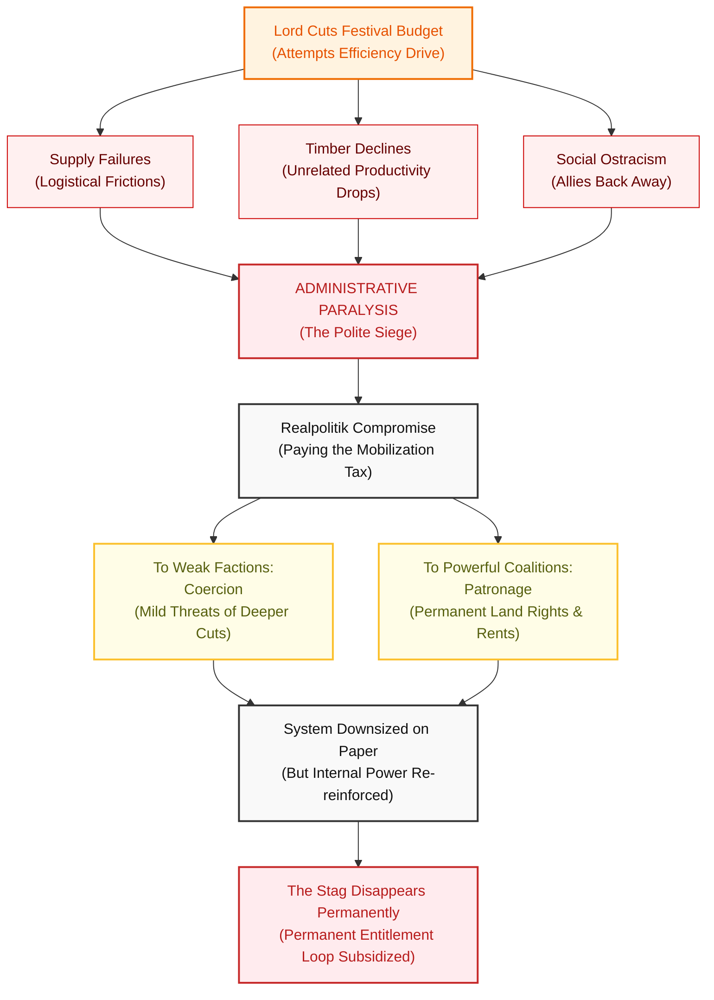

To avoid complete paralysis, the lord attempts a less desirable, thoroughly political middle ground. He deploys his two currencies strategically.

To the less powerful factions of the village, he applies mild coercion—quietly suggesting that louder complaints might force him to make even deeper cuts to their primary employment sectors.

To the most powerful internal coalition—the influential villagers and key estate stewards—he offers significant patronage. He grants them additional land-usage rights and special permits allowing them to operate their businesses outside previous noise ordinances. This gives them exclusive economic opportunities and guaranteed higher revenue. In exchange, they agree to shoulder some of the reduced festival costs and publicly support the scaling back.

The lord manages to avoid the worst of the immediate backlash. The festival is downsized without a total collapse of the estate.

However, the solution is deeply suboptimal. He has merely traded one form of systemic waste for another. He has given away valuable land rights and permanent regulatory exceptions that will carry their own long-term, compounding costs. The estate is now slightly leaner on paper, but the internal power structure has been reinforced. The patronage he paid to make the efficiency drive politically viable has created entirely new dependencies and expectations for the future.

Instead of a traditional celebration honoring the stag, the estate now finds itself paying a permanent entitlement to key interest groups just to keep the peace. Any attempt to demonstrate fiscal responsibility is met with realpolitik consequences.

This is precisely how scale makes the Dual Masters Problem destructive. Small organizations can suppress the problem through sheer proximity. Large ones cannot. The patronage-coercion machine becomes structural, concrete, and permanent. The institution gradually, gracefully, and completely reorganizes around its own internal comfort and survival, leaving the original mission as nothing more than a historical curiosity on a dusty plaque.

And the stag, of course, has long since left the forest.

---

**Section 4: The Special Hell of Centralized Systems**

The Dual Masters Problem transitions from a rather predictable institutional eccentricity to a thoroughly absorbing civilizational comedy the precise moment it takes root within highly centralized systems. One observes this grand entertainment at its absolute finest within planned economies, sprawling government monoliths, and heavily regulated public sectors.

These magnificent structures combine immense scale with an altogether more potent ingredient: the near-total absence of external feedback. A vulgar private enterprise must constantly contend with customers who might abruptly choose to leave, investors who can aggressively withdraw their capital, and the unyielding arithmetic of a profit-and-loss ledger.

Centralized monopolies face no such rude shocks. In their delightful world, institutional failure does not result in contraction, a painful restructuring, or a quiet trip to the bankruptcy courts. Instead, it serves as the ultimate justification for an increased budget and expanded regulatory authority. It is a marvelous arrangement where the reward for complete incompetence is a larger empire. One can only admire the sheer ingenuity of it.

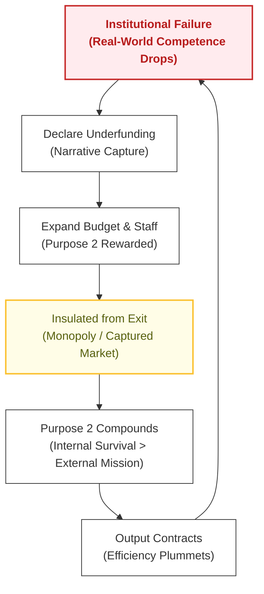

This structural insulation breeds a highly specific, beautifully detached administrative blindness. The individuals piloting these systems are entirely insulated from the vulgar reality of resource generation. They do not need to create wealth; they merely need to draft a convincing memorandum to the Treasury. It must be quite a serene way to live, really.

When a multi-billion-pound injection fails to move the needle on public literacy or hospital waiting times, the administrative mind rarely concludes that the underlying methodology is fundamentally broken. Instead, they assume with absolute sincerity that they simply haven’t spent *enough*.

They do not personally feel the pinch of rising income taxes, the drag of public debt, or the long-term economic decay caused by starving the productive sectors of the economy. Those costs are borne entirely by the anonymous taxpayer. To the administrator, capital is an infinite, magical resource that appears on the balance sheet like manna from heaven. It is a charmingly naive view of thermodynamics.

| Metric | Private Enterprise | Centralized Monolith |
| :--- | :--- | :--- |
| **Primary Feedback** | Profit & Loss / Customer Exit | Budget Growth / Bureaucratic Voice |
| **Failure Consequence** | Bankruptcy / Institutional Closure | Increased Funding / Scale Expansion |
| **Cost Burden** | Internal Shareholders & Owners | External Taxpayer & General Public |
| **Limit on Purpose 2** | Hard Market Boundary *(Survival demands utility)* | None *(Self-Compounding and unchecked)* |

Because centralized systems lack any external limiter, the patronage-coercion machine is free to compound year after year. When ministers or senior bureaucrats realize they cannot command the real-world results they promised in their manifestos, they fall back on the only tool that guarantees immediate domestic tranquility: patronage.

They grease the wheels by manufacturing new compliance directorates, expanding headcounts, and doling out regulatory favors to key internal constituencies. This growth is neither accidental nor random. It is the **Leadership Mobilization Cost** operating out in the open.

The politician pays nothing out of his own pocket; he simply charges it to the public treasury. As long as the crisis can be managed long enough to secure a reassuring soundbite on the evening news, the intervention is deemed an unmitigated success. Meanwhile, the politician reaps the quiet loyalty of the newly expanded client class living off the system's rents. It is all quite wonderfully transactional.

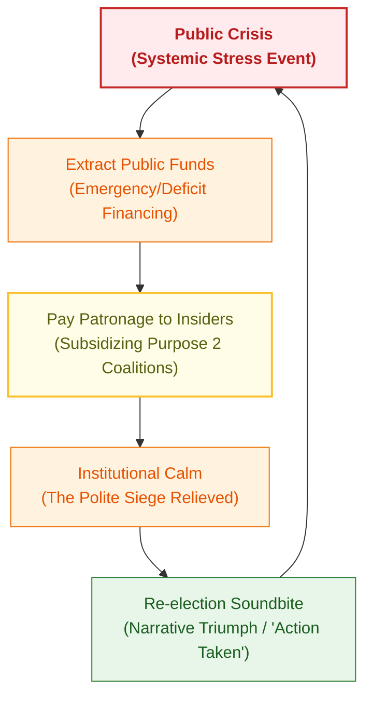

By this stage, the original, noble purpose of the institution barely registers as a minor concern. The daily operational reality shifts entirely from solving an external problem to managing internal coalitions and maintaining the expensive appearance of momentum.

The true stability of this loop, however, relies on the moral vocabulary supplied by the **Mode B Ratchet**. It provides the perfect linguistic camouflage for naked self-interest.

Within this framework, institutional expansion is beautifully reframed as "social justice." The protection of insider slack is defended as "staff well-being." The aggressive defense of an bloated budget is presented as "protecting the vulnerable." Every structural failure and every budgetary overrun is transformed into a moral necessity. Any critic who objects is instantly flagged as cold-hearted and cruel, which saves the bureaucracy the trouble of having to argue the facts. It is a masterclass in psychological arbitrage.

The public, of course, pays this hidden levy on every front:

* **In Currency:** Through escalating tax burdens and systemic inflation.

* **In Time:** Through chronic shortages, decaying infrastructure, and absurd waiting lists.

* **In Quality:** Through a steady, visible decline in the baseline standards of public life.

Yet, as they watch the service collapse, they are continuously informed by the very people running it that the true culprit is a lack of collective compassion. One has to laugh, really.

The **Dual Masters Problem** is not a failure of execution. It is a structural law of physics governing large, living institutions. When you remove strong external correction—when there is no threat of competitor exit, no risk of institutional death, and no hard accountability to empirical results—Purpose 2 will always consume Purpose 1\. The organism will inevitably reorganize to serve its own internal comfort.

Market discipline, open competition, and genuine consequences for failure do not eradicate the Dual Masters Problem entirely, but they act as a heavy iron brake on its progress. They make it prohibitively expensive for an organization to prioritize its own comfort over reality.

Centralized systems are uniquely prone to the most catastrophic, decadent versions of this drift precisely because they systematically dismantle the only feedback loops that could keep the machine honest. They build a fortress around the bureaucracy, ensure the tea remains perfectly warm, and leave the populace outside to wonder why the roof is leaking.

---

**Section 5: Civilizational Implications**

If one treats the Dual Masters Problem as merely a localized headache for management consultants or a tedious item for an internal audit, one misses the true grandeur of the comedy. When this particular machine operates at a civilizational scale, it ceases to be a mere administrative inconvenience. It becomes an exceptionally thorough, beautifully systematic method for quietly liquefying the foundations of a functioning society. It is all quite fascinating to watch from a safe distance.

Vast institutions were originally granted their charters to perform remarkably practical, rather heavy lifting. They were expected to transmit functional competence to the young, preserve a predictable civic commons, resolve genuine external crises, and maintain the structural scaffolding required for general prosperity. It was a perfectly sensible blueprint, designed to ensure that the realm remained relatively orderly and that one’s investments didn't vanish overnight.

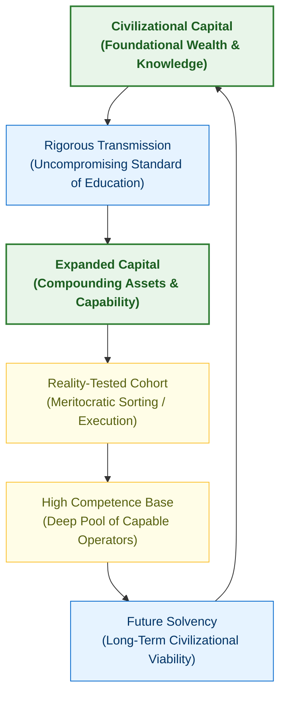

When these structures instead decide to optimize for their own domestic tranquility, their expanded budgets, and the social status of their senior staff, the ripples are felt far beyond the office car park. A thriving society requires a few remarkably basic reference points to remain upright:

* The capacity to pass down clear, reality-tested knowledge and practical skills to the next generation without the curriculum dissolving into a group therapy session.

* A sufficient amount of shared reality so that citizens can speak the same language, disagree with a modicum of productivity, and coordinate on obvious existential challenges.

* An incentive architecture that genuinely rewards actual competence rather than political virtuosity or a talent for internal coalition building.

The moment the Dual Masters architecture hardens across our major organs of state, these reference points experience a rather rapid thermodynamic decay.

Schools naturally begin to prioritize staff room harmony and the moral self-image of the administrators over the tedious, confrontational work of rigorous instruction. Regulators discover that it is infinitely safer to expand their own paper empires and insulate themselves from blame than to actually resolve a practical dilemma out in the wild. Governments learn to view the state not as a trust to be stewarded for posterity, but as a magnificent patronage machine to be run for short-term electoral comfort.

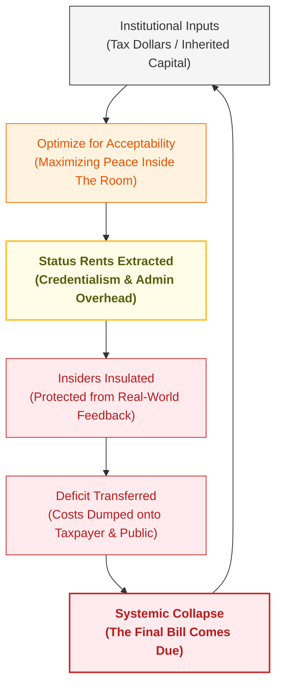

The final yield of this drift is a civilization that becomes **brilliantly anti-fragile for the insiders and catastrophic for everyone else**. The individuals piloting the ship learn how to thrive magnificently amid the general dampness of the decay. Their budgets swell quite nicely. Their titles remain delightfully grand. Their moral self-importance remains entirely unblemished.

The anonymous public, meanwhile, sits outside in the rain, footing the actual bill of lading. They endure the escalating tax brackets, the visibly decaying services, the chronic shortages, and the distinct, unsettling realization that the machine has ceased to have any interest in their existence. It is a bit of a nuisance for them, one imagines.

This particular configuration possesses the unfortunate quality of being entirely unsustainable. A civilization cannot indefinitely devour its own structural foundations—the transmission of genuine capability, a coherent shared reality, and the basic capacity to move forward—without eventually becoming thoroughly brittle and susceptible to the slightest external shock.

Yet, when the inevitable failures occur, the system reacts with its customary grace: it points to the collapse as the ultimate proof that the bureaucracy requires further growth, greater funding, and complete insulation from public meddling. The loop is entirely self-funding and perfectly locked.

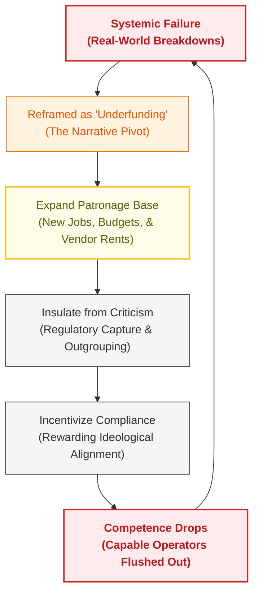

The true comedy at the heart of the tragedy is that the people operating the levers are rarely doing so with a cynical sneer. A great many of them are perfectly nice individuals who go to work in thoroughly polished shoes and sincerely believe they are performing the Lord’s work. To their minds, expanding the department, inventing a new diversity oversight committee, and protecting their internal coalitions *is* the sacred mission. They do not perceive the drift as a betrayal of their charter. They view it as an expression of pure virtue.

That is the exquisite trap of the modern administrative state. Left to their own devices, without the rude, cleansing friction of sharp external correction, large living institutions will naturally, inevitably, and with complete moral serenity, reorganize around their own comfort and survival.

They will sit contentedly inside their fortresses, keeping the staff room quiet, maintaining the budgets, and making certain the tea is always poured at precisely the right temperature, while the roof of the wider civilization slowly and gracefully collapses onto their heads.

---

**Section 6: Restoration Pathways**

To imagine that the Dual Masters Problem can be entirely eradicated from human affairs is to indulge in the sort of charming, utopian daydreaming usually reserved for undergraduate poetry societies. It simply cannot be done. The moment you assemble more than three human beings under a single letterhead and hand them a budget, the corporate organism will develop a survival instinct, a distinct fondness for plush carpets, and a collective desire to ensure its pensions remain safe.

If one were so inclined to solve these problems—perhaps because the proletariat have begun gathering pitchforks near the East Gate and the noise is ruining one's afternoon—I suppose one might consider the following redress to force Purpose 2 back into its cage.

### THE CONSTRAINED EQUILIBRIUM

┌────────────────────────────────────────────────────────┐
│                    THE INSTITUTION                     │
│                                                        │
│   [Purpose 1: The Stated Mission] ──► 🌟 DOMINANT      │
│                 ▲                                      │
│                 │                                      │
│   [Purpose 2: Bureaucratic Growth]                     │
│                 │                                      │
└─────────────────┼──────────────────────────────────────┘
                  │ (When Bureaucracy expands, it triggers...)
                  ▼
       🛑 [ REAL-WORLD MARKET CEILING ]
          Customers can freely walk away.
                  │
                  ▼ (Which immediately forces...)
       💸 [ SHARP FINANCIAL PAIN ]
          Revenue drops and bankruptcy threatens survival.
                  │
                  ▼ (The Result:)
   The institution must cut the fat or completely die.

#### System Dynamics
* **The Default Urge:** Inside the organization, the bureaucracy (Purpose 2) naturally wants to grow, protect itself, and swallow more of the budget. 
* **The Trigger:** If the bureaucracy gets too big, the actual work (Purpose 1) suffers. The product or service slips.
* **The Hard Stop:** In a free market, the organization hits a hard Market Ceiling—it cannot force anyone to buy its product. 
* **The Deflection:** The moment output drops, customers immediately walk away. This inflicts sudden, severe Financial Pain straight onto the organization's bottom line.
* **The Correction:** Because the organization will literally go bankrupt and die if it ignores this pain, leadership is mechanically forced to slash the bureaucratic bloat and refocus entirely on the Stated Mission.

It is a thoroughly impolite business, of course, but I suspect any meaningful remedy would have to rely on a few rather sharp, structural adjustments:

* **Roll back entitlement status.** I suppose one might start by removing the assumption that any administrative body has a divine right to an automatic, recurring budget. If a program's funding were dragged out into the daylight and openly debated on an ongoing basis, the comedy would change instantly. If the so-called "compassion of the state" cannot be negotiated within the boundaries of fiscal reality, it ceases to be compassion. It becomes a rather transparent ransom note paid to sustain institutional comfort.

* **Reassert domain sovereignty.** One might consider returning primary authority to those small, highly localized units of human organization—individuals, families, and local communities—that actually have skin in the game. Centralized administrative monopolies would have to be strictly fenced off and restricted to a few narrow, unmistakably defined utilities. It is amazing how well people manage their own affairs when the regional steering committee forgets to send a memorandum.

* **Restore honest feedback and real consequences.** I suspect a functioning system ought to possess the architectural capacity to register failure without automatically demanding a salary bump for the director. One would need to introduce accountability mechanisms that possess actual teeth, rather than the customary internal reviews where the bureaucracy gracefully clears itself of all charges and asks for a larger staff room.

* **Introduce meaningful external pressure on government monopolies.** The most effective solvent for an entrenched administrative empire is the terrifying prospect of customer choice. Where feasible, one might introduce the cleansing friction of exit—whether through school voucher systems or competitive public services. When a government institution no longer harbors any fear of losing its relevance or its budget, Purpose 2 runs entirely unchecked.

* **Treat institutions as tools, not sacred national shrines.** No public agency or compliance board possesses an inherent right to perpetual growth. If an organization continuously optimizes for its own internal serenity over its stated charter, I suppose the logical response is to treat it like any other broken appliance. One simply downsizes it, overhauls it, or sends it straight to the scrapheap.

| Intervention | Administrative Response | Real-World Payout |
| :--- | :--- | :--- |
| **Internal Review** | "We need a larger budget and more staff." | Continued Systemic Decay |
| **Blunt Metric (KPI)** | Gamed Targets / Superficial Compliance | Metric Met, Actual Output Drops |
| **External Pressure (Exit)** | **Terror / Structural Realignment** | **Purpose 1 Restored** *(Mission success)* |

The objective here is not to completely banish the softer, more empathetic impulses of public life. Care and consideration for the fragile have their proper place in any decent society, if one is into that sort of thing. The goal is merely **dynamic complementarity**—the cold, structural reality that the velvet cushions of public kindness must always be kept firmly inside the heavy iron frame of accountability and long-term horizons.

Without these rude external correctives, the Dual Masters Problem will simply continue to execute its natural, clockwork drift. The bureaucracy will sit comfortably inside its fortress, generating an endless stream of moral self-justifications, while the wider public underwrites a service that grows continuously more expensive as it fades away.

But as a purely intellectual exercise, the solution is remarkably straightforward. One merely has to apply the constraints and watch the machine correct itself. Whether anyone actually has the stomach to turn the gears is, of course, entirely someone else's problem. I believe my tea is ready.

---

**Conclusion:** 

The Dual Masters Problem is not a bug in the system. It is a predictable feature of large living institutions. Once created, they acquire their own survival instincts, and those instincts tend to grow stronger over time unless deliberately restrained.

Understanding this does not require conspiracy theories or moral panic. It only requires acknowledging that organizations are made of human beings operating under incentives — and that those incentives shift dramatically at scale when external correction is weak or absent.

The pattern is ancient, but its modern form is particularly dangerous. Mode B provides the perfect ideological operating system to justify endless expansion, while centralized funding removes the natural consequences that would otherwise force restraint. The result is a civilization quietly being eaten from within by its own institutions — each one convinced it is doing good while serving itself first.

Restoration is possible, but it will not be easy or comfortable. It requires consistent, structural pressure from the outside: sunset clauses, domain sovereignty, honest feedback, external competition where feasible, and the political will to treat institutions as tools rather than sacred, self-justifying entities.

The alternative is continuation of the current trajectory: ever-growing Purpose 2, declining real outcomes, increasing fragility masked by moral language, and the slow erosion of the shared foundations required for a high-trust, high-competence civilization.

Large institutions will always tend toward self-preservation. The only question is whether we will allow them to do so unchecked, or whether we will impose the boundaries, accountability, and external correction necessary to keep them serving their original purposes.

The choice, and the consequences, remain ours to accept.

---

**Author’s Note:**

This paper does not offer a tactical prescription. A structural problem this large, historical, and deeply embedded will require highly complex, multi-layered corrections. These papers are a deliberate attempt to describe the poisoned dynamics with absolute clarity first.

---

